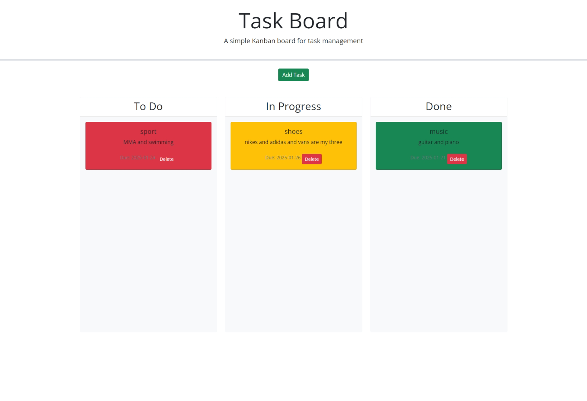
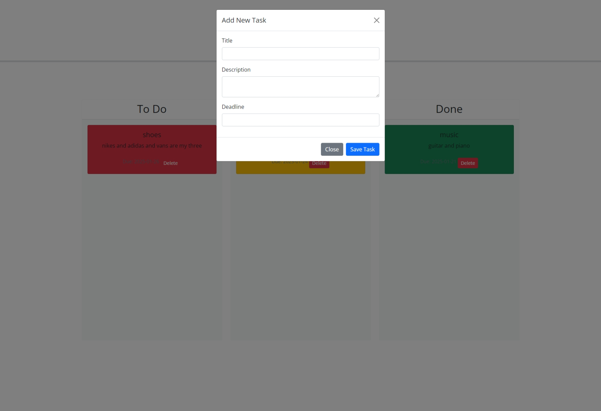
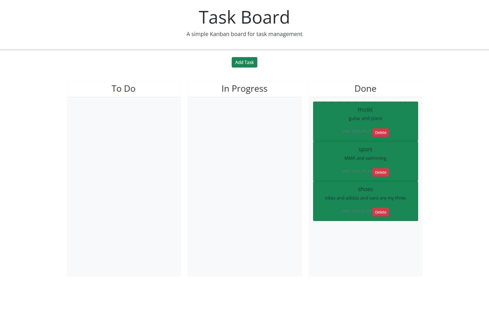

# Task Board Time !  ( Module 5 )

## Description

so in this project, we are creating something that can log tasks and put them in order from to-do,in progress, done! You can log in and move the boxes to were your task is at, and the color changes deopending in which colum you place it. This is using  html and css but mostly all the work is coming from JavaScript ! So if you have a task, log it in then sselect the due date and place it in order of how its going for you! Fun and simple 

## Acceptance Criteria

GIVEN a task board to manage a project
WHEN I open the task board
THEN the list of project tasks is displayed in columns representing the task progress state (Not Yet Started, In Progress, Completed)
WHEN I view the task board for the project
THEN each task is color coded to indicate whether it is nearing the deadline (yellow) or is overdue (red)
WHEN I click on the button to define a new task
THEN I can enter the title, description and deadline date for the new task into a modal dialog
WHEN I click the save button for that task
THEN the properties for that task are saved in localStorage
WHEN I drag a task to a different progress column
THEN the task's progress state is updated accordingly and will stay in the new column after refreshing
WHEN I click the delete button for a task
THEN the task is removed from the task board and will not be added back after refreshing
WHEN I refresh the page
THEN the saved tasks persist

## Installation 

1. create a GitHub
2. clone the starter code into my repository
3. open on VScode and arrange the files
4. work on what needs to be added into the JavaScript part as well as some HTML
5. run and check the code
6. make sure the task box is popping up
7. check the colors are changing when you move it from each column
8. test abnd run it that i works smooth
9. complete and push it to GitHub

* The image shows my personal use of the task board  !! should look like :

